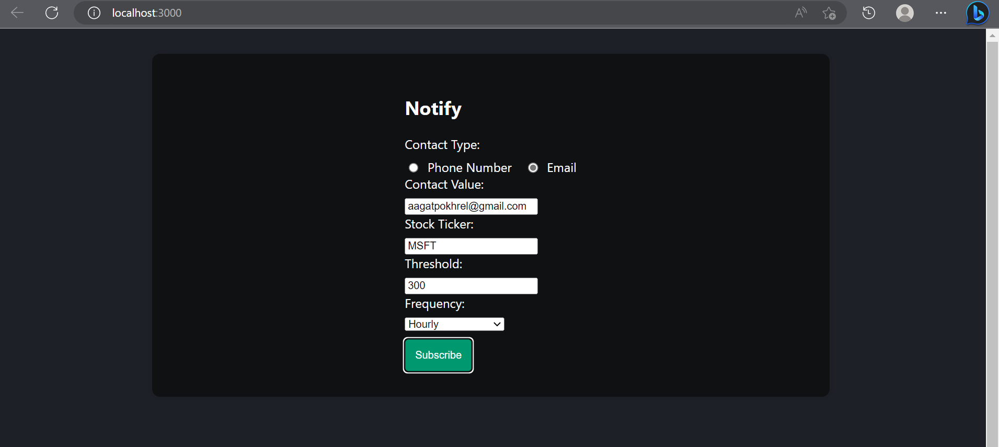

# Stockify

Notification application, that periodically informs about specific stocks from yahoo finance. If the stock price of specified price exceeds the prediction lable then user is notified before hand with the help of email and sms.


## Installation

Install my-project with npm and pip

Prerequisites

- Go to twilio (for sms) and create an account and setup a phone number and sid and token.
- Then create a `.env` file in backend folder and put the sensitive information there
- Go to mailgun for setup (for mail) and get the mail key. put this in `.env` as well.

For frontend
```bash
  cd frontend
  npm install
  npm run
```

For backend
 ```bash
  cd backend
  pip install -r requirements.txt
  python main.py
```   


## API Reference

#### Test the backend

```http
  GET /
```

#### Subscribe

```http
  POST /subscribe
```

| Parameter | Type     | Description                       |
| :-------- | :------- | :-------------------------------- |
| `contactType`      | `string` | **Required**. ContactType of subscriber |
| `contactValue` | `string` | **Required**. Value of contact of subscriber |
| `stockTicker` |	`string` |	**Required**. Stock Ticker to subscribe to
| `threshold` |	`float` |	**Required**. Price threshold to be notified
| `frequency` |	`string` |	**Required**. Frequency of notifications


## Screenshots




